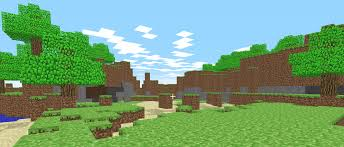

<h2> Repo_Minecraft_copy</h2>

To play follow this link: https://zen-kare-c531fd.netlify.app/ 

The game begin with start page, after click on start game user navigated to new world which he can constract the world.

 Each time a tool is chosen it becomes purpule.

Tools can pick specific item, other items which picked with other tool will fail(and get red border):

<ul>
  <li>shovel used for land</li>
  <li>pickaxe used for stone</li>
  <li>axe used for tree green and tree trunk.</li>
</ul>

After use of right tool on specific item, the item added to inventory.

Click on inventory take the block, remove chosen tool and after clicking on spot you want to add in world the block is added.

Reset button is used for reset of world.

